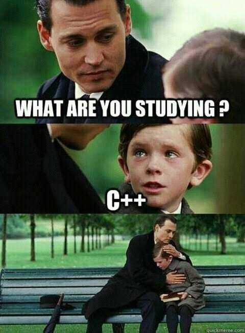

<p align="center">
 
 <h2 align="center">Frate</h2>
 <p align="center">This command line application came to fruition out of the desperate hopes and dreams of a few people looking to softly lighten their suffering while using c++. </p>
</p>


# THIS PROJECT IS STILL IN ALPHA DEVELOPMENT, STUFF MAY BREAK


# STAR THE REPO




## Built with
- tears
- sadness
- neovim
- vscode

## Build the binary from source
### Prerequisites


```
gcc >= 13
and
cmake >= 3
```

### Basic Usage
```bash
frate new #optional -d for defaults
# ... Prompts you for information about your project

frate build #optional -j <number> for multi threaded builds

frate run # runs the project

frate add p <package-name> #optional -l for latest package

frate search p <query> #Searchs local cache for packages

frate update index #updates the package index

frate clean #optional -c to also clean the cache

frate watch #watches the project for changes and automatically builds and runs

```


### Installation
```bash
git clone https://github.com/frate-dev/frate.git
cd frate
cmake -DCMAKE_BUILD_TYPE=Release ./
sudo make install
```

### Why use Frate
- Easy project creation and maintenance
- Simple default configurations that are easy to extend
- Get the functionality of utilities like cargo, npm , or yarn and use a language you're already familiar with
- Dencentralized package management
- NEVER touch a CMakeLists.txt again


### Your friend in the world of C/C++
frate is a command line utility used to expedite building modern c/c++ applications.

- [x] Easy project initialization
- [x] Easy dependency management
- [x] Easy license management
- [x] Multi mode builds
    - [x] Modal dependency management
- [x] Cross compilation
- [x] Project Blueprinting
- [x] Remote builds
- [ ] Legacy project conversion
- [ ] Extensible json configuration
